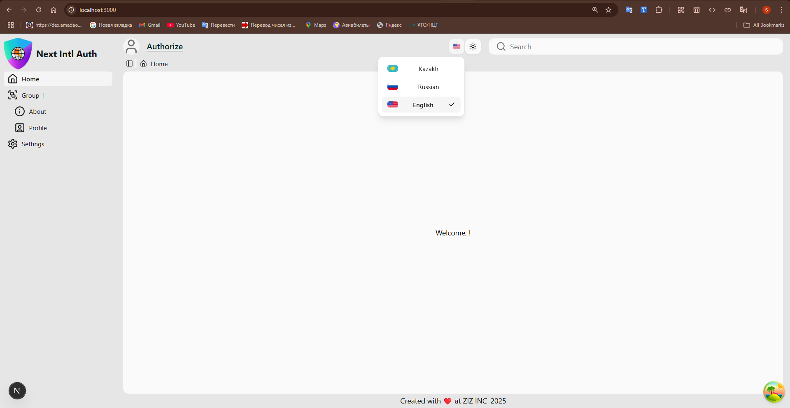

# Next Intl Auth Boilerplate
> A complete, production-grade Next.js starter with internationalization, authentication, UI components, testing and more.
Production-ready Next.js boilerplate for authentication, i18n, theming and testing.

---

[](https://next-intl-auth-mu.vercel.app/)
[](LICENSE)
[](https://nextjs.org/)
[](https://github.com/Sayyat/next-intl-auth/stargazers)
[](https://github.com/Sayyat/next-intl-auth/network/members)
[](https://github.com/Sayyat/next-intl-auth/issues)
[](https://github.com/Sayyat/next-intl-auth/commits/main)

---

## 🔥 Preview



## Deployment

This project is live and deployed on **Vercel**!  
Visit the live demo: **[Next Intl Auth Boilerplate Live](https://next-intl-auth-mu.vercel.app/)**

## Features

- ⚡️ **Next.js 14**: Fast and scalable React framework with App Router.
- 🌍 **next-intl**: Internationalization (i18n) with fully typed translations.
- 🔒 **Next-Auth v5**: Authentication with JWT, OAuth, and social providers.
- 🎨 **shadcn/ui**: Beautiful accessible components with Tailwind CSS.
- 🛡️ **Zod**: End-to-end type-safe validation.
- 🚀 **TypeScript**: 100% typed full-stack application.
- 🌓 **Dark Mode**: Light / dark mode with system preference.
- 📈 **React Query**: Powerful data fetching and caching.
- 🧪 **Vitest & Playwright**: Full testing stack (unit, integration, e2e).

---

## Quick Start

### Prerequisites

Make sure you have the following installed:

- Node.js >= 18.x
- Yarn (preferred) or npm
- Git

### Installation

1. Clone the repository:

   ```bash
   git clone https://github.com/Sayyat/next-intl-auth.git
   cd next-intl-auth
   ```

2. Install dependencies:

   ```bash
   yarn install
   ```

3. Create a `.env` file in the root directory and add the following environment variables:

   ```env
   API_URL=<Your API URL>
   AUTH_SECRET=<Your Auth Secret>
   NEXTAUTH_URL=http://localhost:3000
   API_URL=http://127.0.0.1:8000
   ```

4. Start the development server:

   ```bash
   yarn dev
   ```

   The application will be available at `http://localhost:3000`.

---

## File Structure

<details>
<summary>Click to expand the file structure</summary>

```plaintext
src/
├── app/
│   ├── (ui)/
│   │   ├── group-1/
│   │   │   ├── about
│   │   │   │   └── page.tsx
│   │   │   └── profile
│   │   │       └── page.tsx
│   │   ├── group-2/
│   │   │   ├── analytics
│   │   │   │   └── page.tsx
│   │   │   └── dashboard
│   │   │       └── page.tsx
│   │   ├── settings
│   │   │   └── page.tsx
│   │   ├── layout.tsx
│   │   └── page.tsx
│   ├── api/
│   │   └── auth/
│   │   │   └── [...nextauth]/
│   │   │       └── route.ts
│   │   └── proxy/
│   │       └── [...pathname]/
│   │           └── route.ts
│   └── layout.tsx
├── core/
│   ├── components/
│   │   ├── AppSidebar.tsx
│   │   ├── DynamicBreadcrumb.tsx
│   │   ├── Footer.tsx
│   │   ├── Header.test.tsx
│   │   ├── Header.tsx
│   │   └── RenderSidebarGroup.tsx
│   ├── config/
│   │   └── routes.ts
│   ├── data/
│   │   └── env/
│   │       ├── client.ts
│   │       └── server.ts
│   ├── hooks/
│   │   └── useDynamicBreadcrumb.ts
│   ├── providers/
│   │   │── ClientProvidersWrapper.tsx
│   │   └── ThemeProvider.tsx
│   ├── styles/
│   │   └── globals.css
│   └── utils/
│       │── header.d.ts
│       └── routes.d.ts
├── features/
│   ├── authentication/
│   │   │── components/
│   │   │   │── EmailSentDialog.tsx
│   │   │   │── LoginDialog.tsx
│   │   │   │── ProfileDialog.tsx
│   │   │   │── ProfileImageIcon.tsx
│   │   │   │── RegisterDialog.tsx
│   │   │   └── ResetDialog.tsx
│   │   │── hooks/
│   │   │   │── useAuth.ts
│   │   │   │── useCities.ts
│   │   │   └── useProfile.ts
│   │   └── lib/
│   │       │── queryKeys.ts
│   │       └── zod.ts
│   ├── services/
│   │   ├── client.ts
│   │   └── server.ts
│   ├── types/
│   │   ├── city.d.ts
│   │   ├── payload.d.ts
│   │   ├── profile.d.ts
│   │   └── response.d.ts
│   └── index.ts
├── locales/
│   ├── config/
│   │   ├── locales.ts
│   │   ├── request.ts
│   │   ├── server.ts
│   │   ├── translation.ts
│   │   └── translation-types.d.ts
│   └── messages/
│       ├── en.json
│       ├── kk.json
│       └── ru.json
├── shared/
│   └── components/
│   │   ├── svg/
│   │   │   └── Loading.tsx
│   │   ├── ui/ - shadcn ui components
│   │   │   ├── accordion.tsx
│   │   │   ├── ...............
│   │   │   └── tooltip.tsx
│   │   ├── app-sidebar.tsx
│   │   ├── Checkbox.tsx
│   │   ├── FloatingLabelInput.tsx
│   │   ├── FloatingLabelPasswordInput.tsx
│   │   ├── FloatingLabelPhoneInput.tsx
│   │   ├── Input.tsx
│   │   ├── LanguageSelect.tsx
│   │   ├── nav-main.tsx
│   │   ├── nav-projects.tsx
│   │   ├── nav-secondary.tsx
│   │   ├── nav-user.tsx
│   │   ├── Select.tsx
│   │   └── ThemeSelect.tsx
│   ├── hooks/ shadcn hooks + custom shared hooks
│   │   ├── use-mobile.ts
│   │   └── use-toast.ts
│   │── lib/
│   │   ├── case.ts
│   │   ├── constants.ts
│   │   ├── query.ts
│   │   ├── tokenService.ts
│   │   └── utils.ts
│   │── services/
│   │   ├── api.ts
│   │   ├── client.ts
│   │   └── server.ts
│   └── types/
│       ├── api.d.ts
│       ├── next-auth.d.ts
│       └── next-intl.d.ts
├── tests/
│   ├── e2e/ - all e2e tests folder
│   └── setup.ts
├── auth.ts
└── middleware.ts 
```

</details>

---

## How to Use

### Authentication

- **Sign Up**: Use the `/register` page to create a new account. The backend API handles user registration and returns
  access and refresh tokens.
- **Log In**: Access `/login` to authenticate users. Tokens are stored securely, and JWT is decoded for user details.

### Localization

- The project uses `next-intl` for localization.
- Languages supported: `Kazakh`, `English`, and `Russian`.
- The language can be changed using the dropdown in the header.

### Toast Notifications

- Feedback is provided using `react-toastify`.
- Example: Error messages during authentication or form validation feedback.

### Zod Validation

- Zod is used for client-side schema validation for forms.
- Errors are displayed with translations based on the current locale.

---

## Customization

### Add New Languages

1. Create a new JSON file in the `locales/messages/` directory, e.g., `fr.json` for French.
2. Add translations for the keys in the JSON file.
3. Update the `locales` array in `locales/config/locales.ts`:

   ```typescript
   export const locales = ['en', 'ru', 'kk', 'fr'];
   ```

4. The language will automatically be added to the selector.

### Add New Pages

1. Create a new folder under the `app` directory, e.g., `app/dashboard`.
2. Add a new `page.tsx` file inside the folder.
3. Use the existing components for layout and styles.

---

## 📚 Tech Stack

| Technology                                                      | Description                                           |
|-----------------------------------------------------------------|-------------------------------------------------------|
| **[Next.js](https://nextjs.org/)**                              | React framework with server-side rendering            |
| **[Next-Auth](https://authjs.dev/)**                            | Authentication system for Next.js apps                |
| **[Next-Intl](https://next-intl-docs.vercel.app/)**             | Localization and translation management               |
| **[Tailwind CSS](https://tailwindcss.com/)**                    | Utility-first CSS framework                           |
| **[shadcn/ui](https://ui.shadcn.com/)**                         | Beautiful prebuilt components                         |
| **[TypeScript](https://www.typescriptlang.org/)**               | Static typing for scalable applications               |
| **[Zod](https://zod.dev/)**                                     | Type-safe schema validation                           |
| **[@tanstack/react-query](https://tanstack.com/query/latest)**  | Powerful data fetching library                        |
| **[Vitest](https://vitest.dev/)**                               | Fast unit testing framework                           |
| **[Playwright](https://playwright.dev/)**                       | Type-safe environment variable management for Next.js |
| **[@t3-oss/env-nextjs](https://github.com/t3-oss/t3-env)**      | End-to-end browser testing framework                  |
| **[React-Toastify](https://fkhadra.github.io/react-toastify/)** | Toast notifications                                   |

---

## 🚀 Running Tests

This project includes a robust testing setup to ensure code quality and application reliability. Below are the details
for running different types of tests:

### 1. **Unit and Integration Tests**

We use **Vitest** with **React Testing Library** to write and run unit and integration tests.

#### Run Unit/Integration Tests:

```bash
yarn test
```

#### Watch Tests:

```bash
yarn test:watch
```

#### Coverage Report:

```bash
yarn coverage
```

---

### 2. **End-to-End (E2E) Tests**

We use **Playwright** for writing end-to-end tests.

#### Run E2E Tests:

```bash
yarn test:e2e
```

#### Playwright Test Runner UI:

```bash
yarn test:e2e --ui
```

### Notes:

- Ensure the application is running locally before starting E2E tests.
- Configure environment variables in `.env.test` for test-specific setups.

---

### 3. **Test Setup**

- **Unit Testing Framework**: [Vitest](https://vitest.dev/)
- **E2E Testing Framework**: [Playwright](https://playwright.dev/)
- **Component Testing**: [React Testing Library](https://testing-library.com/docs/react-testing-library/intro/)

#### Test Directory Structure

- Unit tests: `src/` (next to each component)
- E2E tests: `src/tests/e2e/`

---

### Example Test Command:

```bash
yarn test  # Runs all unit and integration tests
yarn test:e2e  # Runs all E2E tests
```

---

## License

This project is licensed under the **GNU General Public License v3.0**.  
See the [LICENSE](LICENSE) file for details.
This project is licensed under the terms of the [GNU GPL v3](LICENSE).

---

## Author

Made with 💜 by [Sayat Raykul (ZIZ INC)](https://github.com/Sayyat)

If you like this project, please ⭐️ star it on GitHub!  
It helps me continue building great open-source tools.
